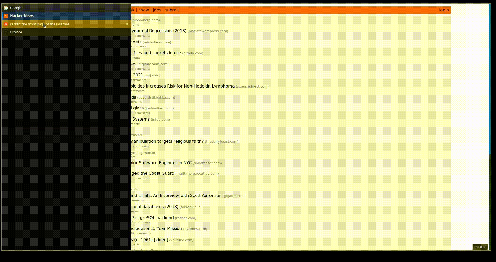

# Add Last Active Class To Tab

## Description

This is a very simple add-on for [Tree Style Tab](https://github.com/piroor/treestyletab/) Firefox Extension.

Add a last-active class to the last accessed TST tab:



## Requeriments

1. Install [Tree Style Tab – Get this Extension for 🦊 Firefox (en-US)](https://addons.mozilla.org/en-US/firefox/addon/tree-style-tab/)

2. Go to Tools > Add-Ons > Extensions > Tree Style Tab > Preferences > Extra style rules for sidebar contents

3. Add:

    ```css
    .tab.last-active {
        background-color: #997719 !important;
    }
    ```

## Installation

[Add Last Active Class To Tab – Get this Extension for 🦊 Firefox (en-US)](https://addons.mozilla.org/en-US/firefox/addon/add-last-active-class-to-tab/)
